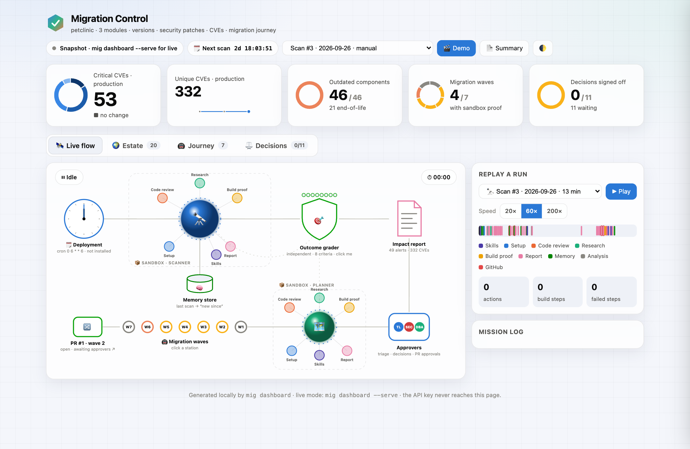
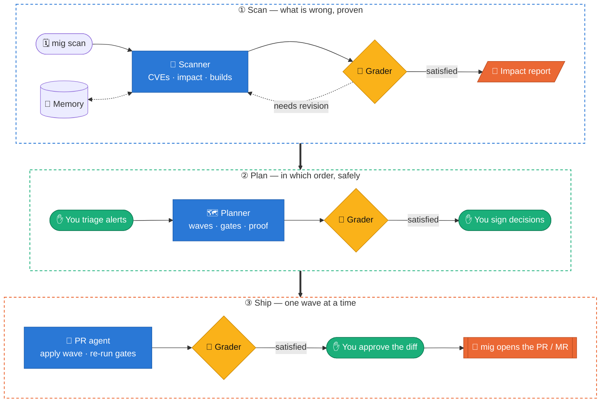
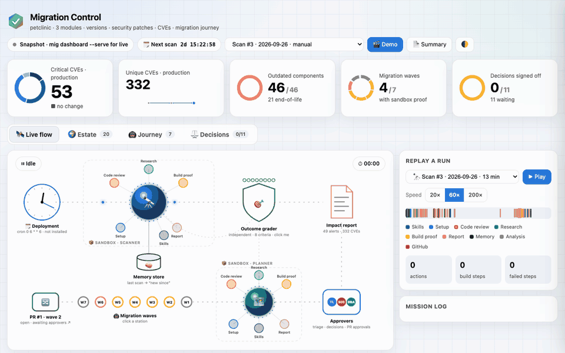
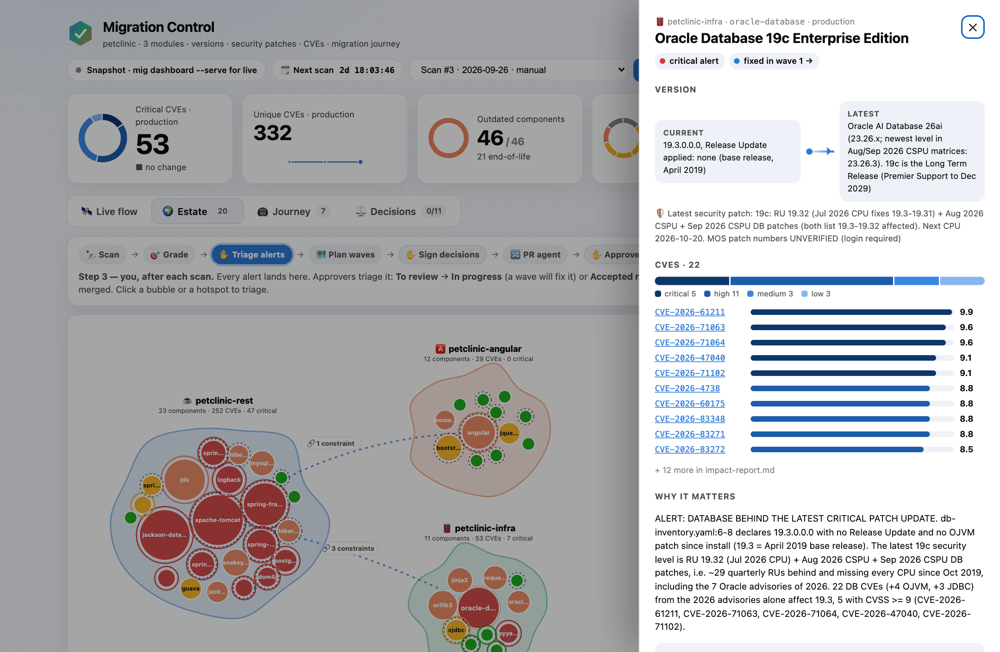
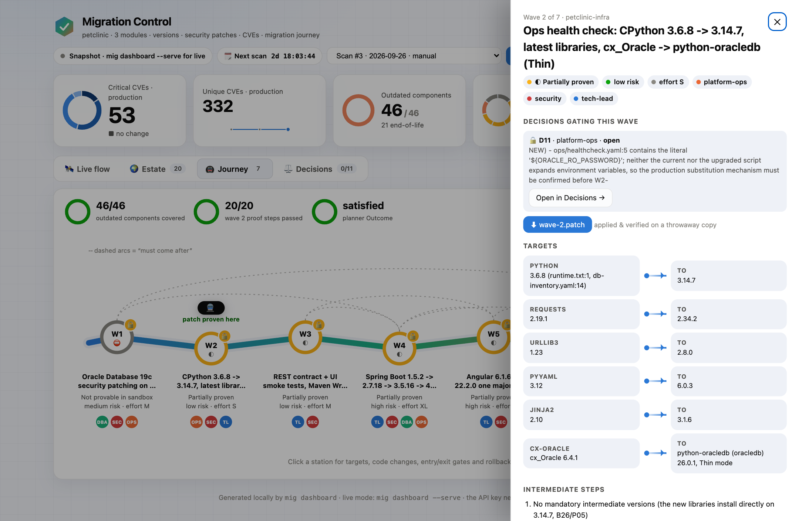
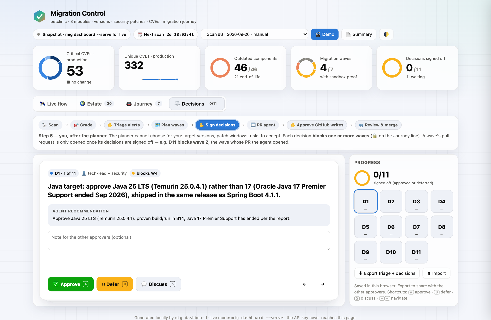

<div align="center">

<picture>
  <source media="(prefers-color-scheme: dark)" srcset="docs/assets/banner-dark.svg">
  
</picture>

<br>

[](https://github.com/HenriAycard/migration-control/actions/workflows/ci.yml)
[](pyproject.toml)
[](LICENSE)
[](https://docs.claude.com/en/docs/claude-code)
[](#-where-the-agents-run)
[](CHANGELOG.md)

**Point it at the repositories you migrate together. Get a sourced impact report, a gated migration plan,<br>
and pull requests you approve — without handing a single write credential to an agent.**

[**Quickstart**](#-quickstart) · [**How it works**](#-how-it-works) · [**Dashboard**](#%EF%B8%8F-migration-control-the-dashboard) · [**Configuration**](#%EF%B8%8F-configuration) · [**Security**](#-security-model) · [**Roadmap**](docs/ROADMAP.md)

<br>

<picture>
  <source media="(prefers-color-scheme: dark)" srcset="docs/assets/hero-dark.png">
  
</picture>

<sub>Migration Control replaying a real scan of the bundled example estate (Spring PetClinic, pinned to old releases on purpose).</sub>

</div>

<br>

## ✨ Why migration-control

Keeping a real estate up to date is not "bump one dependency": modules call each other, run on shared runtimes and
databases, and a framework major drags a JDK, a driver and an API contract along. **migration-control** analyses the
**whole estate at once**, proves its claims by actually building, and turns findings into **reviewable, gated work** —
with a human at every step that matters.

<table>
<tr>
<td width="33%" valign="top">

### 🔭 Scan
Inventory of every component of every module, latest official versions and security patches, **every CVE with an
official source** — and the breaking changes located in *your* code, `file:line`, proven by real builds on target versions.

</td>
<td width="33%" valign="top">

### 🗺️ Plan
Ordered, **reversible waves** driven by cross-module constraints, each with measurable entry/exit gates, rollback,
approvers, risk and effort — and the first code wave **proven in a sandbox** with a patch that applies.

</td>
<td width="33%" valign="top">

### 🔀 Ship
A PR agent applies one wave and re-runs its gates. **You** review the diff and approve; only then does `mig` push the
branch and open the **GitHub PR / GitLab MR** with your token. Never merged by a machine.

</td>
</tr>
<tr>
<td valign="top">

### 🎯 Graded, every time
An **independent grader** checks each run against a rubric; failed criteria go back to the agent until it is
`satisfied`. Golden cases (`mig eval`) catch regressions when you change prompts or models.

</td>
<td valign="top">

### 💻 Runs where you want
**Locally with Claude Code** (your subscription, one Docker container per run, code never leaves your machine) or on
**Claude Managed Agents** in the cloud. Same prompts, contracts and dashboard.

</td>
<td valign="top">

### 🧑‍⚖️ Built for approvers
One-page summaries, an Excel workbook for auditors, triage and decision tracking, and a 🎬 **demo mode** that
replays your own runs for sponsors, tech leads and security.

</td>
</tr>
</table>

## 🚀 Quickstart

**See it in 30 seconds — no key, no cost** (recorded real runs of the example estate):

```bash
pipx install git+https://github.com/HenriAycard/migration-control
mkdir petclinic && cd petclinic
mig init --example petclinic
mig dashboard --offline          # then click 🎬 Demo
```

**Run it on your own repositories:**

```bash
mkdir my-estate && cd my-estate   # a small control folder, separate from your app repos
mig init                          # interview → migration.yaml (+ .gitignore)
claude setup-token                # in your own terminal → CLAUDE_CODE_OAUTH_TOKEN=… in .env
mig doctor && mig up              # checks everything, builds the sandbox image
mig scan                          # background run — follow it with `mig dashboard --serve`
mig plan                          # migration waves from the latest graded scan
mig pr 4                          # prepare wave 4's PR/MR → approve it in the dashboard
```

> [!TIP]
> Prefer a conversation? `mig skill install`, then type **`/migrate`** in Claude Code: it interviews you about your
> repositories, writes `migration.yaml`, checks and provisions — and only starts a run when you say so.

<details>
<summary><b>📋 Requirements</b></summary>

<br>

| | Needed for |
|---|---|
| 🐍 Python ≥ 3.9 + `git` | everything |
| 🤖 [Claude Code](https://docs.claude.com/en/docs/claude-code) + a Claude subscription (or an API key) | the local runner (default) |
| 🐳 Docker | per-run isolation of the local runner (default) |
| 🔑 Anthropic API key with credit | the managed runner only |
| 🔐 A GitHub / GitLab token | private repos (read) · publishing PRs/MRs (write) |

</details>

## 🧭 How it works



| | Agent | You get | Contract |
|---|---|---|---|
| 🔭 | **Scanner** | `impact-summary.md` (one page) · `impact-report.md` · `impact-report.json` · `impact-report.xlsx` | [impact-report.schema.json](migration_control/resources/schemas/impact-report.schema.json) |
| 🗺️ | **Planner** | `migration-plan.md` · `migration-plan.json` · one-page summary · `wave-<n>.patch` + evidence | [migration-plan.schema.json](migration_control/resources/schemas/migration-plan.schema.json) |
| 🔀 | **PR agent** | one `.patch` per repository · `pr.json` · approver-ready `pr-description.md` · gate logs | [pr.schema.json](migration_control/resources/schemas/pr.schema.json) |

Every claim follows the bundled [`regulated-sourcing`](migration_control/resources/skills/regulated-sourcing/SKILL.md)
rules: official sources only (vendor advisories, registries, NVD, OSV, GitHub advisories), otherwise tagged `UNVERIFIED`.

## 🖥️ Migration Control, the dashboard

A single local page — `mig dashboard` (static) or `mig dashboard --serve` (live feed + approvals on `127.0.0.1`).

<p align="center">
  
</p>

<table>
<tr>
<td width="50%"></td>
<td width="50%"></td>
</tr>
<tr>
<td align="center"><b>🌍 Estate</b> — modules as islands, components as bubbles sized by CVEs; click for versions, sources, the fix and the wave that ships it.</td>
<td align="center"><b>🚇 Journey</b> — the plan as a metro line: gates, rollback, approvers, the proven patch, and the PR review for each wave.</td>
</tr>
<tr>
<td colspan="2"></td>
</tr>
<tr>
<td colspan="2" align="center"><b>⚖️ Decisions</b> — the questions only humans can answer, each locking the waves it blocks until it is signed.</td>
</tr>
</table>

## 🏃 Where the agents run

| `runner` | How it runs | Auth | Your code leaves the machine? |
|---|---|---|:-:|
| 🐳 **`local` + `docker`** *(default)* | Claude Code headless, one container per run | `CLAUDE_CODE_OAUTH_TOKEN` (`claude setup-token`) or `ANTHROPIC_API_KEY` | ❌ |
| 💻 `local` + `none` | Claude Code headless on this machine, no isolation | your Claude Code login | ❌ |
| ☁️ `managed` | Claude Managed Agents: cloud sandbox, Outcome grader, memory store, scheduled deployment | `ANTHROPIC_API_KEY` with credit | ✅ |

Locally, `mig` reproduces the managed pieces — an independent grader loop, `.mig/memory/`, cron via
`mig schedule install` — and a run that hits a Claude usage limit is **paused, not lost**: `mig resume <run>`.
Works the same on a VPS.

## 🔀 From a wave to a pull request

```console
$ mig pr 4
▶ preparing pr (local · docker) for wave 4 of plan run-20261007-075222-39be
▶ run-20261007-110322-8175 started in the background
…
✓ grader satisfied — review it, then `mig approve <run>` or `mig deny <run>`
```

1. **The PR agent prepares** — applies the wave on fresh checkouts, re-runs the exit gates, writes one patch per repo and
   the PR description. **It has no write credential.**
2. **You review** the diff, the gate results and the description in the wave's drawer, then **✅ Approve & publish** or
   **✋ Deny** (or `mig approve` / `mig deny` in the terminal).
3. **`mig` publishes**, from your machine: branch `migration/wave-<n>-…`, one GitHub PR / GitLab MR per repository.
   Nothing is ever merged.

> [!NOTE]
> A module is published when it has `token_env` with **write** access and a branch to target. Local paths and upstream
> repos you cannot write to simply get a patch to apply yourself.

## 🧪 Golden cases

```bash
mig eval add my-baseline   # derive evals/my-baseline.yaml from a scan you trust — commit it
mig eval check             # free: check the latest scan against every case
mig eval run               # re-scan each case in an isolated memory (costs a scan per case)
```

Facts are checked with *at least* semantics — new CVEs never fail a case, a lost component or alert does — and results
are tied to the scanner's config fingerprint, so `mig status` tells you when a changed prompt or model is not vouched for yet.

## ⚙️ Configuration

<details>
<summary><b>📄 <code>migration.yaml</code> — full example</b></summary>

<br>

```yaml
version: 1
project: acme
runner: {type: local, isolation: docker}
estate:
  - name: billing-api
    repo: https://github.com/acme/billing-api.git
    ref: main                         # branch, tag or commit = "what runs in production"
    token_env: GITHUB_TOKEN           # private repo / publishing PRs; omit for public ones
    depends_on: [ledger-db]           # the grader checks this constraint is analysed
  - name: web
    repo: https://gitlab.com/acme/web
    token_env: GITLAB_TOKEN
    depends_on: [billing-api]
  - name: infra
    path: ./infra                     # local folder or .tar.gz
policy:
  target: latest official stable version and latest security patch for every component
  approvers: [tech-lead, security, platform-ops]
  rules: ["Never recommend a non-LTS Java release."]
sandbox:
  packages: { apt: [openjdk-17-jdk, maven] }
agents:
  model: auto                         # newest Opus-class model, or an exact model id
  max_iterations: 3                   # grader retries
  budget_usd: 25                      # optional per-run cap (API billing)
schedule:                             # optional — on demand otherwise
  cron: "0 6 * * 6"
  timezone: Europe/Paris
```

Reference: [`migration-config.schema.json`](migration_control/resources/schemas/migration-config.schema.json) ·
`mig validate` renders every prompt and rubric into `.mig/rendered/` so you can read exactly what the agents get.

</details>

<details>
<summary><b>🧰 All commands</b></summary>

<br>

| Command | What it does |
|---|---|
| `mig init [--example petclinic]` | write `migration.yaml` (interactive) or copy the example |
| `mig validate` · `mig doctor` | check the config · check Docker, Claude auth, tokens, repo access |
| `mig up` | local: build the sandbox image · managed: create/update the workspace objects |
| `mig scan` · `mig plan [--scan RUN]` | start runs (background; `--foreground` for cron/CI) |
| `mig pr <wave>` · `mig approve <run>` · `mig deny <run>` | prepare a PR/MR · publish it · reject it |
| `mig stop <run>` · `mig resume <run>` | stop a run · resume one paused by a usage limit |
| `mig eval add\|check\|run\|status` | golden cases |
| `mig status` · `mig outputs [RUN]` | runs, verdicts, cost, evals · copy outputs to `./outputs/` |
| `mig dashboard [--serve] [--offline]` | build / serve Migration Control |
| `mig schedule install\|remove` · `pause\|unpause` + `mig run-now` | scheduling (local cron · managed deployment) |
| `mig skill install [--project]` | install the `/migrate` Claude Code skill |

</details>

<details>
<summary><b>📦 How your code reaches the agent</b></summary>

<br>

**Local runner** — `mig` checks every module out into `.mig/work/<run>/workspace/` (clone with your token, or copy the
local path), mounts it at `/workspace` and deletes it after the run. Tokens never leave your machine.

**Managed runner**

| Module | Mode | Fresh on scheduled runs? | Where the token goes |
|---|---|:-:|---|
| public GitHub / GitLab | the agent clones it | ✅ | no token |
| private GitHub | `github_repository` session resource | ✅ | Anthropic API, as the repository's authorization token |
| private GitLab · local path | snapshot uploaded with the Files API | ⚠️ last `mig up` | stays on your machine |

</details>

## 🔒 Security model

| Guarantee | How |
|---|---|
| 🔑 **No write credential for agents** | PRs/MRs are opened by `mig` on your machine, only after you approve the prepared diff — and never merged. |
| 🙈 **Secrets stay put** | Keys and tokens are never written to `.mig/`, prompts, logs or the page, and never appear on a command line (containers get them by name, git uses `GIT_ASKPASS`). |
| 🧱 **Isolation by default** | One Docker container per run. Running directly on the host (`isolation: none`) is an explicit opt-in. |
| 🛡️ **Local-only dashboard** | Listens on `127.0.0.1`; every action needs a per-start secret embedded in the served page and a same-origin request. |
| 📚 **Sourced claims** | Official sources or `UNVERIFIED`. Findings are for humans to review, not an authority. |

Found a vulnerability? Please report it privately — see [SECURITY.md](SECURITY.md).

## 💸 What a run costs

Measured on the example estate (3 modules, ~180 components, real builds), equivalent at API list prices:

| 🔭 Scan (2 grader iterations) | 🗺️ Plan | 🔀 PR |
|:-:|:-:|:-:|
| ~45 min · ~$20 | ~18 min · ~$5 | ~6 min · ~$2 |

On a Claude subscription a heavy scan uses a large share of a usage window — runs are **on demand** unless you schedule
them, `mig status` shows the cost of every run, and `agents.budget_usd` caps a run on API billing.

## 🤝 Contributing

Issues and PRs are welcome — start with [CONTRIBUTING.md](CONTRIBUTING.md). The test suite drives the whole loop (agent →
grader → fix, pause/resume, prepare → approve → push) against a fake `claude`, a local bare repo and a stubbed PR API,
so it runs in seconds and never spends a token.

<div align="center">

<br>

**[Roadmap](docs/ROADMAP.md)** · **[Changelog](CHANGELOG.md)** · **[Security](SECURITY.md)** · **[License: Apache-2.0](LICENSE)**

<sub>Built with Claude Code. Agents propose — humans decide.</sub>

</div>
